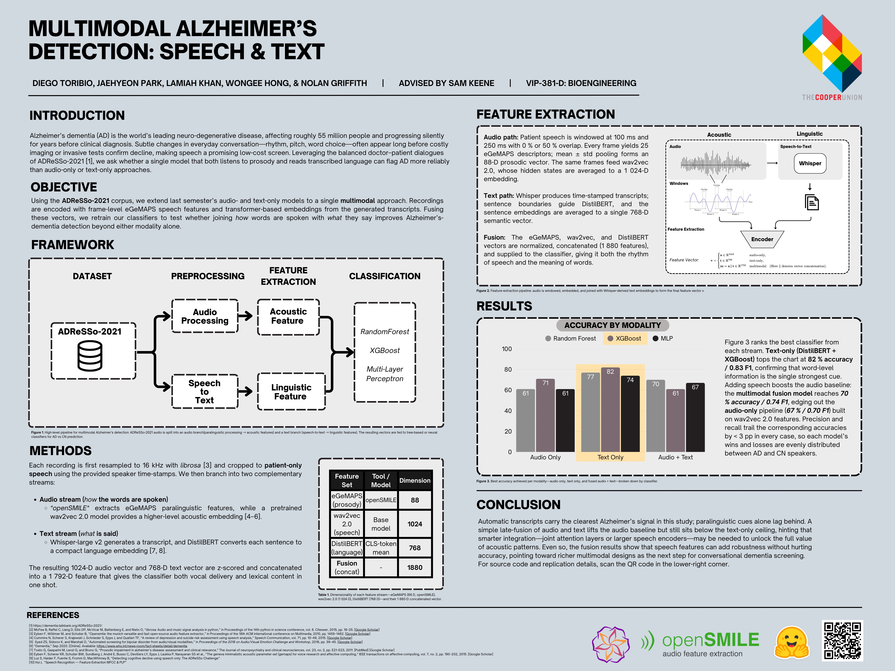
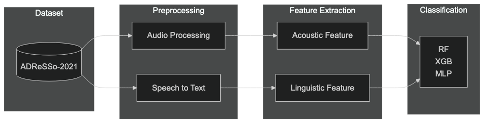
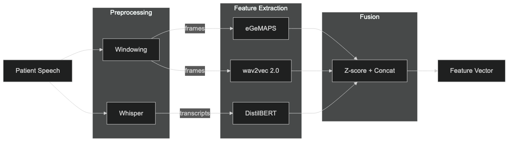
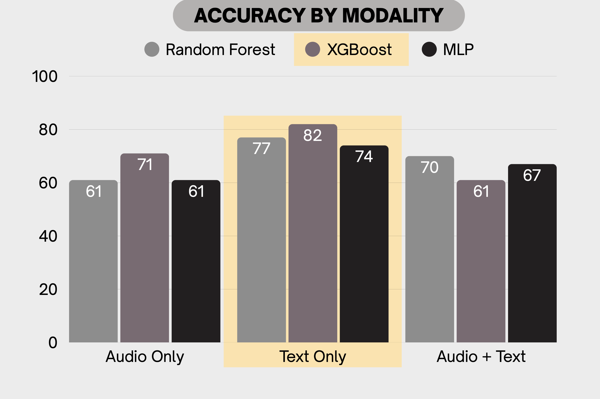

## Multimodal Alzheimer’s Detection: Speech & Text

### Introduction  
Alzheimer’s dementia (AD) is the world’s leading neuro-degenerative disease, affecting roughly **55 million** people and progressing silently for years before clinical diagnosis. Subtle changes in everyday conversation—rhythm, pitch, word choice—often appear long before costly imaging or invasive tests confirm decline, making speech a promising low-cost screen. Leveraging the balanced doctor–patient dialogues of **ADReSSo-2021** [1], we ask whether a single model that both *listens* to prosody and *reads* transcribed language can flag AD more reliably than audio-only or text-only approaches.

 

### Objective  
Using the **ADReSSo-2021** corpus [1], we extend last semester’s audio- and text-only models to a single **multimodal** approach. Recordings are encoded with frame-level eGeMAPS speech features and transformer-based sentence embeddings from Whisper transcripts. Fusing these vectors, we retrain our classifiers to test whether joining *how* words are spoken with *what* they say improves Alzheimer’s-dementia detection beyond either modality alone.

 

### Framework

**Figure 1.** High-level pipeline for multimodal Alzheimer's detection: ADReSSo-2021 audio is split into an audio branch(paralinguistic processing → acoustic features) and a text branch (speech-to-text → linguistic features). The resulting vectors are fed to tree-based or neural
classifiers for AD vs CN prediction.

| Abbreviation | Model |
|--------------|-------|
| RF | RandomForest |
| XGB | XGBoost |
| MLP | Multi-Layer Perceptron |

 

### Methods  
Each recording is first resampled to 16 kHz with *librosa* and cropped to **patient-only speech** using the provided speaker time-stamps.  We then branch into two complementary streams:

* **Audio stream (*how* it is said).**  
  Frame-level paralinguistic cues are pulled with the eGeMAPS configuration of *openSMILE*, and a higher-level acoustic embedding is taken from a pretrained wav2vec 2.0 model [4–6].

* **Text stream (*what* is said).**  
  Whisper-large v2 supplies the transcript; each sentence is embedded with DistilBERT and mean-pooled to one document vector [7, 8].

The resulting vectors are **z-scored, concatenated, and fed to Random-Forest, XGBoost, and LightGBM classifiers**.  This late-fusion set-up (after Haulcy & Glass [2]) lets us test whether blending prosody with language outperforms unimodal baselines.

| Feature set            | Tool / model     | Pooled dim. |
|------------------------|------------------|-------------|
| eGeMAPS (prosody)      | *openSMILE*      | **88**      |
| wav2vec 2.0 (speech)   | Base model       | **1024**   |
| DistilBERT (language)  | CLS-token mean   | **768**     |
| **Fusion** (concat)    | —                | **1880**   |

 

### Feature Extraction

### Framework

**Figure 2.** Feature-extraction pipeline: audio is windowed, embedded, and joined with Whisper-derived text embeddings to form the final feature vector v.

**Audio path.** Patient speech is windowed at 100 ms and 250 ms with 0 % or 50 % overlap.  Every frame yields 25 eGeMAPS descriptors; mean ± std pooling forms an 88-D prosodic vector.  The same frames feed wav2vec 2.0, whose hidden states are averaged to a 1024-D embedding.

**Text path.** Whisper produces time-stamped transcripts; sentence boundaries guide DistilBERT, and the sentence embeddings are averaged to a single 768-D semantic vector.

The eGeMAPS, wav2vec, and DistilBERT vectors are **z-scored, concatenated (1 880 features), and supplied to the classifier**, giving it both the rhythm of speech and the meaning of words.

 

### Results

**Figure 3.** Performance comparison across modalities.

Figure 3 ranks the best classifier from each stream. **Text-only (DistilBERT + XGBoost)** tops the chart at **82 % accuracy / 0.83 F1**, confirming that word-level information is the single strongest cue. Adding speech boosts the audio baseline: the **multimodal fusion** model reaches **70 % accuracy / 0.74 F1**, edging out the **audio-only** pipeline (**67 % / 0.70 F1**) built on wav2vec 2.0 features. Precision and recall trail the corresponding accuracies by < 3 pp in every case, so each model’s wins and losses are evenly distributed between AD and CN speakers.
 

### Conclusion  
Automatic transcripts carry the clearest Alzheimer’s signal in this study; paralinguistic cues alone lag behind. A simple late-fusion of audio and text lifts the audio baseline but still sits below the text-only ceiling, hinting that smarter integration—joint attention layers or larger speech encoders—may be needed to unlock the full value of acoustic patterns. Even so, the fusion results show that speech features can add robustness without hurting accuracy, pointing toward richer multimodal designs as the next step for conversational dementia screening.

 

### References  

[1] ADReSSo-2021 Challenge Data. <https://dementia.talkbank.org/ADReSSo-2021/>  
[2] R. Haulcy & J. Glass, *Classifying Alzheimer’s Disease Using Audio and Text-Based Representations of Speech*, INTERSPEECH 2020.  
[3] B. McFee *et al.*, “librosa: Audio and Music Signal Analysis in Python,” SciPy 2015.  
[4] F. Eyben *et al.*, “openSMILE: The Munich Versatile and Fast Open-Source Audio Feature Extractor,” ACM MM 2010.  
[5] F. Eyben *et al.*, “The Geneva Minimalistic Acoustic Parameter Set (eGeMAPS) for Voice Research and Affective Computing,” IEEE T-AC 2016.  
[6] A. Baevski *et al.*, “wav2vec 2.0: A Framework for Self-Supervised Learning of Speech Representations,” NeurIPS 2020.  
[7] A. Radford *et al.*, “Robust Speech Recognition via Large-Scale Weak Supervision,” Whisper Tech Report 2023.  
[8] V. Sanh *et al.*, “DistilBERT, a Distilled Version of BERT,” arXiv 1908.08962.